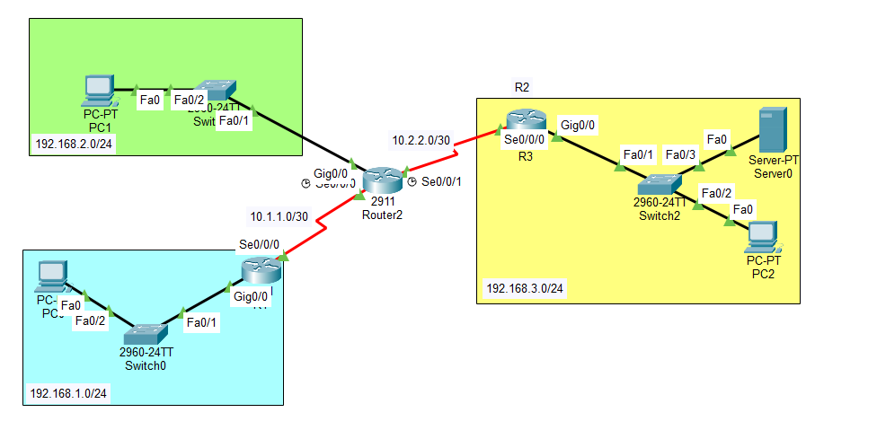

# Configure Local AAA and Syslog 🛡️

## 🗺️ Network Topology



*Our network topology consists of routers (R1, R2, R3) and end devices. This lab focuses specifically on configuring R1 and verifying access via PC-A.*

---

## 🎯 Lab Objectives

1. **Local AAA for Console Access:** Configure a local user database on R1 and enforce AAA authentication on the console line.
2. **Local AAA for VTY (SSH) Access:** Generate RSA crypto keys, configure a named AAA method list, and enforce secure SSH access on VTY lines.
3. **Centralized Logging:** Deploy a physical server to capture system logs (Syslogs) and configure R1 to forward debugging-level logs to this server.

---

## 📊 Addressing Table (R1 Focus)

| Device | Interface | IP Address | Subnet Mask | Default Gateway |
| :--- | :--- | :--- | :--- | :--- |
| **R1** | G0/1 | 192.168.1.1 | 255.255.255.0 | N/A |
| **R1** | S0/0/0 (DCE) | 10.1.1.2 | 255.255.255.252 | N/A |
| **PC-A** | NIC | 192.168.1.3 | 255.255.255.0 | 192.168.1.1 |
| **Syslog Server** | NIC | 192.168.1.10 | 255.255.255.0 | 192.168.1.1 |

---

## 🚀 Configuration Overview

Here is a high-level summary of the commands we used to complete the objectives on **R1**:

### 1. Local Database & Console AAA
```text
R1(config)# username Admin1 secret admin1pa55
R1(config)# aaa new-model
R1(config)# aaa authentication login default local
R1(config)# line con 0
R1(config-line)# login authentication default
